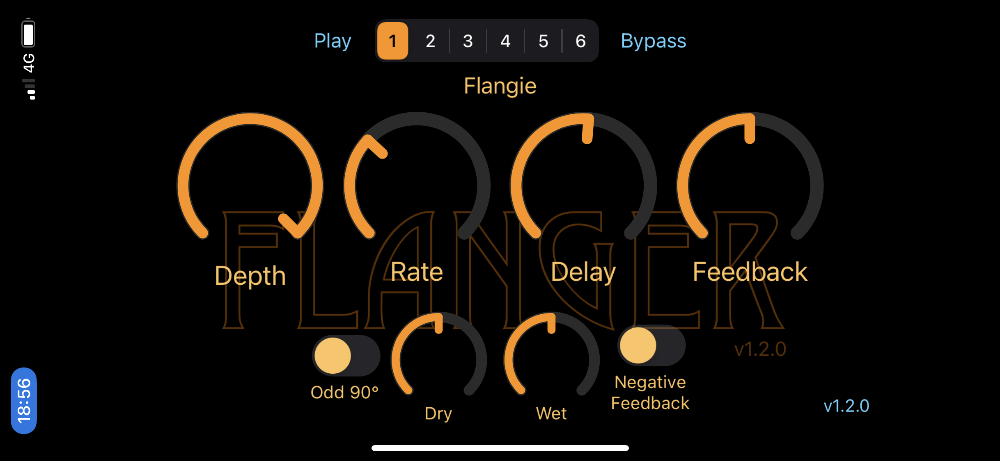

[](https://swift.org)
[](https://developer.apple.com/documentation/audiotoolbox/audio_unit_v3_plug-ins)
[](https://opensource.org/licenses/MIT)



# About SimplyFlange

This is an AUv3 audio effect that creates the iconic "flanging" effect on an audio input. Flanging is a mixture
of the same audio signals with one just slightly ahead or behind the other in time. The original effect was
created by playing the same audio source from two tape plays and then slowing one or the other down by lightly
touching the tape reel flange to very slightly slow down playback. Instead of manually operating two tape decks,
here we just use a digital delay to essentially achieve the same result.

It runs on both macOS and iOS. Each OS has its own app which is used to install app extension that is the AUv3
audio effect.

The code was developed in Xcode 12.4 on macOS 11.2.1. I have tested on both macOS and iOS devices primarily in
GarageBand, but also using test hosts on both devices as well as the excellent
[AUM](https://apps.apple.com/us/app/aum-audio-mixer/id1055636344) app on iOS.

## Quick Guide

* Depth -- controls how much variation there is in the delay from the original signal.
* Rate -- controls the low-frequency oscillator (LFO) that changes the "depth" value. The higher
  the number, the faster the oscillation.
* Delay -- the amount of delay from the original signal to induce. The actual delay is based on this but then
  varies depending on the LFO and the depth setting.
* Feedback -- to really mix things up, you can inject the modified signal back into the delay system. This
  controls how much of the manipulated signal to inject.
* Dry -- the amount of original signal that is used in the output signal.
* Wet -- the amount of the modified signal that is used in the output signal.

There are two esoteric toggles which can dramatically affect the resulting sound:

* Odd 90° -- the low-frequency oscillator (LFO) of every other input audio channel is 90° out-ot-phase with the
rest. For stereo (left and right) inputs and indices starting at zero, the left channel is considered "even" and
the right is "odd". Having out-of-phase LFO signals usually results in a fuller sound.

* Negative Feedback -- this affects how a feedback is summed with the input signal before it reaches the delay
unit. When negative, the feedback signal is essentially subtracted from the input signal which will dramatically
affect the frequencies of the signal sent to the delay unit. Again, this can result in a more interesting and
sonically complex effect than the usual summing that is often done.

The row of buttons at the top of the host demonstration app let you play a prerecorded sample throught the
effect and try out different pre-installed or "factory" presets. Note that these controls are not present in the
audio unit itself, but the factory presets are available from within other AUv3 hosts such as GarageBand -- as
are user presets if the host supports them.

## App Previews

* [iOS App](https://youtu.be/TtUvZscRLT4)
* [iOS GarageBand](https://youtu.be/9oMstnsyq3A)
* [macOS_GarageBand](https://youtu.be/krMEQO1Fmjw)

## AUv3 Compliance

This audio unit passes all
[auval](https://developer.apple.com/library/archive/documentation/MusicAudio/Conceptual/AudioUnitProgrammingGuide/AudioUnitDevelopmentFundamentals/AudioUnitDevelopmentFundamentals.html)
tests, so it should work in your AUv3-compatible host application:

```
% auval -v aufx flng BRay
```

# Building

To successfully compile you will need to edit [Common.xcconfig](Configuration/Common.xcconfig) and change 
`DEVELOPMENT_TEAM` to hold your own Apple developer account ID so you can sign the binaries. You should
also adjust other settings as well to properly identify you and/or your company if you desire.

> :warning: You are free to use the code according to [LICENSE.md](LICENSE.md), but you must not replicate
> someone's UI, icons, samples, or any other assets if you are going to distribute your effect on the App Store.

There are additional values in this file that you really should change, especially to remove any risk of
collision with other AUv3 effects you may have on your system.

The script [newRelease.sh](scripts/newRelease.sh) automates generating new archive versions of both the macOS and iOS
apps and uploads them to the App Store if everything checks out. It uses the DEVELOPMENT_TEAM setting in the
`Common.xcconfig` to handle the authentication and signing.

# App Targets

The macOS and iOS apps are simple hosts that demonstrate the functionality of the AUv3 component. In the AUv3
world, an app serves as a delivery mechanism for an app extension like AUv3. When the app is installed, the
operating system will also install and register any app extensions found in the app.

The `SimplyFlange` apps attempt to instantiate the AUv3 component and wire it up to an audio file player and the
output speaker. When it runs, you can play the sample file and manipulate the filter settings -- cutoff
frequency in the horizontal direction and resonance in the vertical. You can control these settings either by
touching on the graph and moving the point or by using the sliders to change their associated values. The
sliders are somewhat superfluous but they act on the AUv3 component via the AUPropertyTree much like an external
MIDI controller might do.

## Code Layout

Each OS ([macOS](macOS) and [iOS](iOS)) have pretty much the same code layout:

* `App` -- code for the application that hosts the AUv3 app extension. Note that most of the code is actually found in
the external AUv3Support package.
* `Extension` -- UI for the extension. Most of the code is found in the [Packages/Sources](Packages/Sources) folder 
which holds the code for internally-defined Swift packages.

As mentioned above, the [Packages](Packages/Sources) folder holds all of the common code that is used by the above 
products. In it you will find

* [FilterAudioUnit](Packages/Sources/FilterAudioUnit) -- the actual AUv3 AudioUnit written in Swift.
* [Kernel](Packages/Sources/Kernel) -- the Obj-C++ kernel adapter and C++ classes that perform the rendering of audio 
samples.
* [Parameters](Packages/Sources/Parameters) -- definitions for the AudioUnit runtime parameters as well as a preset
definition using the parameters.

Additional supporting files can be found in the [AUv3Support](https://github.com/bradhowes/AUv3Support) project.
